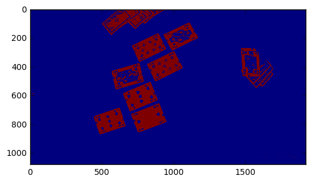
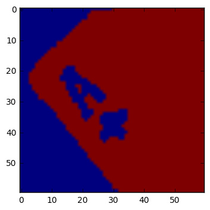
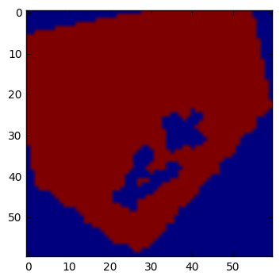
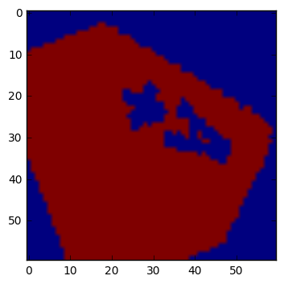
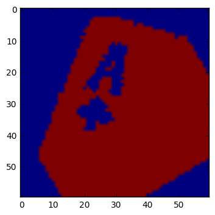

# BridgeReckon

## Rozpoznawanie kart zagrywanych przez graczy podczas rozgrywki brydża sportowego


## Grupa projektowa: Chodacki Maksymilian, Rymarczyk Dawid


# Cel projektu:


## Implementacja algorytmu, który będzie rozpoznawał znajdujące się na stole karty podczas rozgrywki brydżowej. Wytrenowanie takiej sieci neuronowej, która będzie w stanie bardzo szybko i dokładnie rozpoznawać karty do gry.

# Generowanie danych:


## Dane zostały zebrane bezpośrednio przez nas, za pomocą dwóch kamer typu GoPro, podczas rozgrywek I ligi brydża sportowego w Starachowicach. W celu poprawnego nagrania rozgrywki, kamery zostały umieszczone nad stołem do gry, po obu stronach przesłony. Uczestnicy oraz organizatorzy turnieju wyrazili zgodę na nagrania. Kamery były umiejscowione tak, by w zasiegu wizji byla połowa stolu, która znajdowala sie po jednej stronie przesłony. 


# Dane Surowe:


## Dane surowe to poszczególne nagrania, a własciwie klatki z tych nagrań. Aby móc je poprawnie wykorzystać nalezało dokonać ich wstępnej obróbki z wykorzystaniem języka Python 3.5 oraz modułu OpenCV. Do podstawowej obróbki należało wybranie klatki, a następnie nałożenie na nią maski.


```python
import matplotlib.pyplot as plt
import numpy as np
import cv2


img2 = cv2.imread("/home/ubuntu/Desktop/karty2.png")
lower_red = np.array([150,200,150])
upper_red = np.array([255,255,255])
mask1 = cv2.inRange(img2, lower_red, upper_red)
plt.imshow(mask1)
plt.show()
```





# Dane poprawnie technicznie:

## Z tak przygotowanych ramek należało następnie wyciąć kwadraty o rozmiarze 60x60 pikseli, na których została zawarta informacja o tym, jaka to jest karta. Następnie każdy z takich kwadratów był obracany od 1 do 359 stopni, by karta zostala rozpoznana, niezależnie od tego, pod jakim kątem została zagrana. Na jedną wartość karty przypadało kilka przykładowych kwadratów 60x60, w zależnosci od dostępności z nagran. 


```python
import cv2
import numpy as np
import matplotlib.pyplot as plt
from PIL import Image
import os

cards = os.listdir("/home/ubuntu/PycharmProjects/BridgeReckon/Cards/")
card = cards[12]
img = cv2.imread("/home/ubuntu/PycharmProjects/BridgeReckon/Cards/" + card)
lower_red = np.array([150, 200, 150])
upper_red = np.array([255, 255, 255])
mask1 = cv2.inRange(img, lower_red, upper_red)
img = Image.fromarray(mask1)
for i in range(1, 359, 100):
        img_n = img.rotate(i, 0)
        plt.imshow(img_n)
        plt.show()

```














## Takiej samej procedurze zostały poddane obserwacje, które zostały sklasyfikowane jako niebędace kartami, np.: fragment lub calość, na którym znajdował się sam symbol koloru, bądź ilustracja figury, itd. 


# Czyszczenie danych


## Czyszczenie danych polegało na ręcznym wybraniu, na których fragmentach chcemy trenować sieć neuronową.


# Analiza danych


## W celu analizy wykorzystano splotową sieć neuronową z wykorzystaniem modulu keras dla języka Python opartego na tensorflow. Sieć zbudowano na 4 poziomach. 3 z nich były oparte na funkcji aktywacyjnej relu (rectifier) określonej jako: f(x) = max(0,x), natomiast czwarty na funkcji aktywacyjnej softmax, tj. znormalizowanej funkcji eksponencjalnej. Na kadym poziomie wykonywany byl splot2D oraz dokonywano rozmycia (pooling) w kwadratach 2x2 piksele. W 3. warstwie macierz wartości pikseli była sprowadzana do wektora i na jej wyjściu uzyskiwano 500 klas. Na ostatniej warstwie dokonywana była właściwa klasyfikacja na ilość klas. Ilość ta zależy od tego, jak wiele klas zostanie zdefiniowanych typu NoCards. Na przykład dla 10 klas NoCards, ilość klas wyniesie 62 (52 karty + 10 klas NoCards). Powodem, dla którego należy wyróżnic wiele klas NoCards jest brak jednolitego wzoru dla tego typu klasy, a wrzucenie wszystkich przypadków nie-kart do jednej klasy powodowało ogromne straty na dokładnosci klasyfikatora. Uzyskiwano wyniki na poziomie R^2 = 0.0132. Wszystkie wartości pikseli zostały unormowane przez podzielenie przez 255 (wartosc maksymalna). 

## Poniżej zostaną zaprezentowane interesujące fragmenty kodu wykorzystanego przy analizie:

```python
model.add(Convolution2D(20, 5, 5, border_mode="same",
			input_shape=(depth, height, width)))
		model.add(Activation("relu"))
		model.add(MaxPooling2D(pool_size=(2, 2), strides=(2, 2), dim_ordering='th'))
'''
        
## Dodanie warstwy do modelu sieci neuronowej

```python    
model = LeNet.build(width=60, height=60, depth=1, classes=62, weightsPath=args["weights"] if args["load_model"] > 0 else None)
model.compile(loss="categorical_crossentropy", optimizer=opt, metrics=["accuracy"])
if args["load_model"] < 0:
	print("[INFO] training...")
	model.fit(trainData, trainLabels, batch_size=128, nb_epoch=50,
		verbose=1)
	print("[INFO] evaluating...")
	(loss, accuracy) = model.evaluate(testData, testLabels,
		batch_size=128, verbose=1)
	print("[INFO] accuracy: {:.2f}%".format(accuracy * 100))
'''
## Zbudowanie modelu epoka po epoce dla 62 klas i 128 podgrup klasyfikacyjnych

```python
probs = model.predict(testData[np.newaxis, i])<br>
prediction = probs.argmax(axis=1)<br>
'''

## Dokonanie przewidywania do której z klas należeć będzie obrazek. 

# Trenowanie i testy

## Trenowania sieci neuronowej dokonano na 20032 próbkach, natomiast testowania na 2226 próbkach, które nie pochodziły ze zbioru uczącego. Poniżej można zobaczyć jak wraz z przyrostem epoki rosła dokladność przewidywania. 

Epoch 1/50
20032/20032 [==============================] - 38s - loss: 4.1254 - acc: 0.0386    <br>
Epoch 2/50
20032/20032 [==============================] - 37s - loss: 4.1145 - acc: 0.0372    <br>
Epoch 3/50
20032/20032 [==============================] - 31s - loss: 4.0320 - acc: 0.0331    <br>
Epoch 4/50
20032/20032 [==============================] - 33s - loss: 3.8431 - acc: 0.0629 <br>
...<br>
Epoch 21/50
20032/20032 [==============================] - 32s - loss: 13.3471 - acc: 0.1482    <br>
Epoch 22/50
20032/20032 [==============================] - 31s - loss: 13.3439 - acc: 0.1515    <br>
Epoch 23/50
20032/20032 [==============================] - 32s - loss: 13.3411 - acc: 0.1500    <br>
Epoch 24/50
20032/20032 [==============================] - 34s - loss: 13.3386 - acc: 0.1509    <br>
Epoch 25/50
20032/20032 [==============================] - 32s - loss: 13.3361 - acc: 0.1522<br>
...<br>
Epoch 48/50
20032/20032 [==============================] - 29s - loss: 0.1254 - acc: 0.9844    <br>
Epoch 49/50
20032/20032 [==============================] - 27s - loss: 0.0335 - acc: 0.9872    <br>
Epoch 50/50
20032/20032 [==============================] - 32s - loss: 0.0320 - acc: 0.9873    <br>


## Ilość epok została wybrana na zasadzie empirycznego doboru parametru co 5 od 10 do 80 i dla 50 epok wyniki zostaly uznane za satysfakcjonujace. 

## Przykładowe przewidywania dla wybranych kart:

Was 2C Predicted: NoCard<br>
Was KS Predicted: KS<br>
Was 2H Predicted: 2H<br>
Was 7D Predicted: 7D<br>
Was 4C Predicted: 4C<br>
Was JC Predicted: JC<br>

## Uzyskany wynik przy trenowaniu: R^2 = 0,987

## Uzyskany wynik przy testach: R^2 = 0,954

# Podsumowanie:

## Udalo sie wytrenować klasyfikator, który z wysoką dokładnością pozwala przewidzieć jaka karta znajduje się na stole.

## Nie udało się dokonać integracji klasyfikatora z systemem, który analizuje film. System taki został zaimplementowany, polega na tym, że wczytywany jest film, następnie analizowana jest co 120 klata (2s). Na każdą z klatek nakładana jest maska, a następnie jest ona przeszukiwana za pomocą okna przesuwnego o wielkości 60x60 pikseli co 20 pikseli w poziomie, a następnie w pionie. 

```python
for frame in test_frames:
    image = cv2.imread("./test_frames/" + str(frame)) 
    lower_red = np.array([150, 200, 150]) 
    upper_red = np.array([255, 255, 255]) 
    mask1 = cv2.inRange(image, lower_red, upper_red) 
    image = np.asarray(mask1) 
    for (x, y, window) in sliding_window(image, stepSize=size / 3, windowSize=(winW, winH)): 
        if window.shape[0] == winH and window.shape[1] == winW: 
            window = window[np.newaxis, np.newaxis, :, :] 
            clone = image.copy() 
            cv2.rectangle(clone, (x, y), (x + winW, y + winH), (0, 255, 0), 2) 
            probs = model.predict(window) 
            prediction = probs.argmax(axis=1) 
            if int(prediction[0]) < 53: 
                print("[INFO] Predicted: {}".format(prediction[0])) 
'''
## Powyższy fragment kodu obrazuje zasadę działania takiego systemu. Niestety problemy ze środowiskiem, niezgodnościami co do wersji używanych bibliotek oraz brak odpowiedniej ilości czasu, spowodowały, że integracja ta nie przebiegła pomyślnie. 
